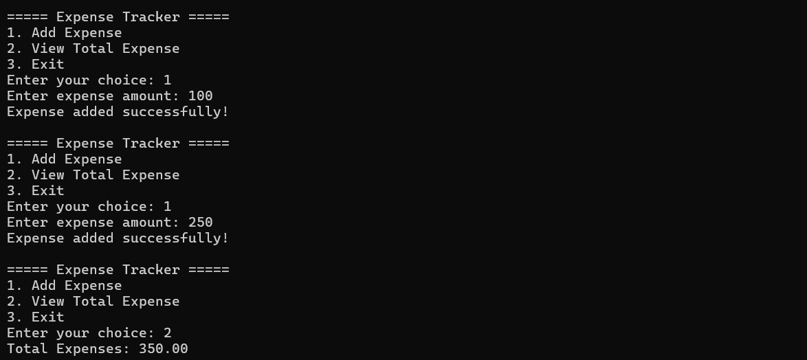

# Expense Tracker in C

A console-based Expense Tracker application developed in C to record and manage expenses.

## Features

- Add new expenses
- View total expenses
- Menu-driven interface
- Simple and user-friendly

## Technologies Used

- C Programming
- Functions
- Loops
- Conditional Statements

## How to Run

```bash
gcc main.c -o expense
./expense
```

## Project Structure

```text
expense-tracker-c/
├── main.c
├── README.md
├── LICENSE
├── .gitignore
└── screenshots/
    └── output.png
```

## Screenshot




## Future Improvements

- File Handling
- Expense Categories
- Date-wise Tracking
- Monthly Reports
- Search Expenses

## Author

Hasini
